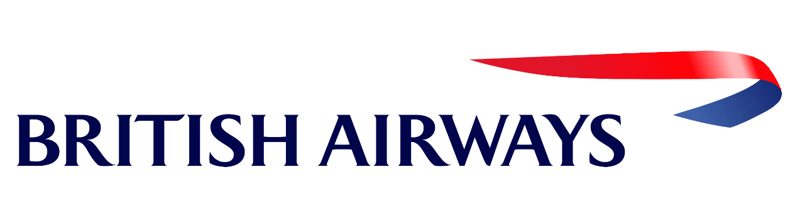

---

# British Airways -  Data Science Project


This repository contains the analysis conducted during my internship at British Airways. The project aimed to gain insights from customer review data and build a predictive model to understand factors influencing buying behavior.

## Tasks

### Task One: Customer Review Analysis

In this task, I scraped and analyzed customer review data to uncover key insights and sentiments. From sentiment analysis to issue identification, we delved into the realm of customer reviews, extracting valuable insights to enhance the British Airways experience.

### Task Two: Predictive Model Building

For the second task, I developed a predictive model to understand the factors influencing buying behavior for British Airways. Leveraging machine learning techniques, the model aimed to predict customer preferences and behavior, helping the company tailor its services and offerings accordingly.

## Repository Structure

```
├── Task1 /                      # Directory for storing data files
│   ├── reviews_scraped.csv      # Dataset containing customer review data
│   └── review_analysis.ipynb    # Jupyter notebook for review analysis
│   └── report.pdf               # Report for review analysis
│   └── README                   # README for review analysis
├── Task2 /                      # Directory for storing data files
│   ├── customer_booking.csv     # Dataset containing customer booking data
│   └── booking_prediction.ipynb # Jupyter notebook for predictive modeling
│   └── report.pdf               # Report for predictive modeling
│   └── README                   # README for predictive modeling
├── LICENSE                      # License file
├── README                       # Main README file
```

## Usage

1. Clone this repository.

2. Navigate to the project directory.

3. Explore the notebooks in the `Task1/` and `Task2/` directories for detailed analysis and modeling steps.

4. Access the datasets in the respective directories for conducting your own analysis.

5. Refer to the reports in the `Task1/` and `Task2/` directories for insights and findings from each task.

## License
[MIT](https://choosealicense.com/licenses/mit/)

## 🔗 Links
[](https://github.com/AlokRanjanIN)
[](https://www.linkedin.com/in/alokranjan-in/)

## Authors

- [Alok Ranjan](https://github.com/AlokRanjanIN)

- 
---
