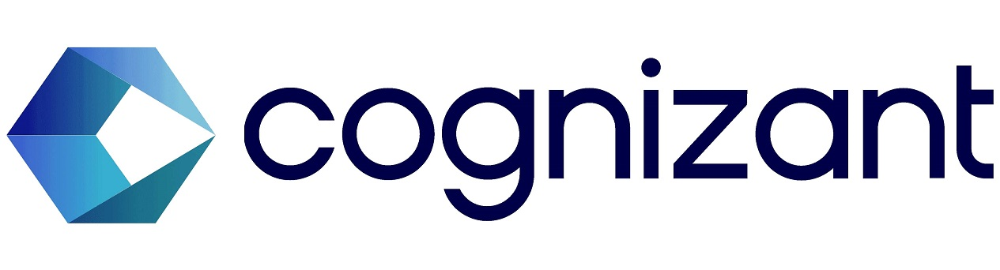

---

# Cognizant -  Artificial Intelligence Project
<a href="https://www.cognizant.com/"></img></a>

This repository contains the analysis conducted during my internship at Cognizant. 

The project aimed to tackle Gala Groceries' supply chain issue by optimizing item stocking to enhance cost efficiency and customer satisfaction by exploring sales data, understanding relational data, building predictive models, and deploying ML algorithms for production.

## Tasks

### Task One: Exploring Customer Data

Explore Gala Groceries' sales data to identify insights and recommendations for optimizing stock levels.

### Task Two: Data Modeling

Understand relational data and formulate a problem statement for predicting stock levels based on sales and sensor data.

### Task Three: Model Building and Interpretation
Develop predictive models using sample data, combining, transforming, and modeling three datasets effectively to address the business problem statement.

### Task Four: Machine Learning Production
Develop machine learning algorithms for production by preparing a Python module for training models and outputting performance metrics.

### Task Five: Quality Assurance
Improve the production machine learning model and discuss optimization strategies with the ML engineering team for better performance before integration.

## Repository Structure

```
├── Task1 /                      # Directory for Task One files
│   ├── sample_sales_data.csv    # Dataset containing sales data
│   ├── EDA.ipynb                # Jupyter notebook for exploratory data analysis
│   ├── eamil.pdf                # Report summarizing findings and recommendations
│   └── README.md                # README for Task One

├── Task2 /                      # Directory for Task Two files
│   ├── data_model_diagram.docx  # Data model diagram
│   ├── Strategic Plans.pdf      # Strategic plan
│   └── README.md                # README for Task Two

├── Task3 /                      # Directory for Task Three files
│   ├── datasets/                # Directory for datasets used in Task Three
│   ├── modeling.ipynb           # Jupyter notebook for modeling
│   ├── results.pdf              # Model results
│   └── README.md                # README for Task Three

├── Task4 /                      # Directory for Task Four files
│   ├── datasets/                # Directory for datasets used in Task Four
│   ├── module_train.py          # Python module for ML
│   └── README.md                # README for Task Four

├── Task5 /                      # Directory for Task Five files
│   └── README.md                # README for Task Five

├── LICENSE                      # License file
└── README.md                    # Main README file
```

## Usage

1. Clone this repository.

2. Navigate to the project directory.

3. Explore the notebooks in the respective Task directories for detailed analysis and modeling steps.

4. Access the Python module in Task Four directory for training the model and outputting performance metrics.


## License
[CC BY-NC-SA](https://creativecommons.org/licenses/by-nc-sa/4.0/legalcode.en)

## 🔗 Links
[](https://github.com/AlokRanjanIN)
[](https://www.linkedin.com/in/alokranjan-in/)

## Authors

- [Alok Ranjan](https://github.com/AlokRanjanIN)
  
   
---


